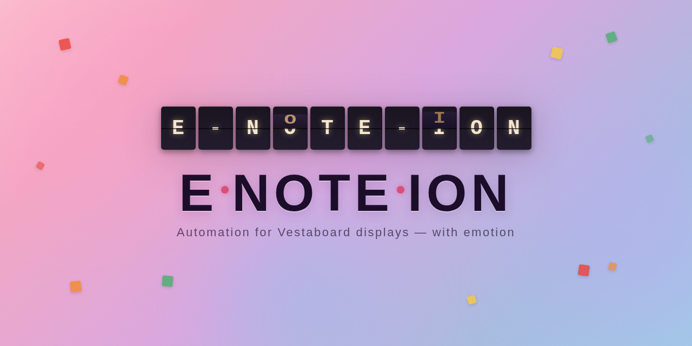

# E•NOTE•ION



[](https://github.com/JasonPuglisi/e-note-ion/actions/workflows/ci.yml)

A self-hosted, code-first content scheduler for Vestaboard split-flap
displays. Define your board content as version-controlled JSON — cron
schedules, templated messages, live data integrations, and a priority queue —
with no web UI or cloud dependency required. Supports both the
[Note](https://shop.vestaboard.com/products/note) (3×15) and the Flagship
(6×22).

> This project is primarily agent-developed using [Claude](https://claude.ai),
> with human design, decision-making, guidance, and review. See
> [Philosophy](#philosophy) for more on the approach.

## Who this is for

E•NOTE•ION is built for developers and power users who want to treat their
board like infrastructure: content in files, schedules in cron, secrets in env
vars, deploys in Docker.

If you'd prefer a friendlier experience — a web UI, drag-and-drop scheduling,
and a polished setup flow — check out
[FiestaBoard](https://github.com/Fiestaboard/FiestaBoard), which nails that
use case beautifully.

## See also

The Vestaboard community has built a lot of great tooling:

| Project | What it does well |
|---|---|
| [FiestaBoard](https://github.com/Fiestaboard/FiestaBoard) | Full-featured self-hosted app with a web UI and a rich scheduling experience |
| [Vestaboard+](https://www.vestaboard.com/vestaboard-plus) | Official cloud subscription with Zapier/IFTTT integration and a curated app marketplace |
| [jparise/vesta](https://github.com/jparise/vesta) | Clean Python library for the Vestaboard API — great if you want to build your own tooling |
| [natekspencer/hacs-vestaboard](https://github.com/natekspencer/hacs-vestaboard) | Home Assistant integration for triggering board updates from automations |
| [Zapier](https://zapier.com) / [IFTTT](https://ifttt.com) | No-code workflow triggers via Vestaboard+ — lowest barrier to entry |
| MCP servers | Emerging tools for LLM-driven board updates from Claude and other agents |

## Running with Docker (recommended)

Pre-built multi-arch images (`linux/amd64`, `linux/arm64`) are published to
the GitHub Container Registry on each release.

First copy `config.example.toml` to `config.toml` and fill in your API keys
and settings (see [Configuration](#configuration) below). Then run:

```bash
docker run -d \
  --name e-note-ion \
  --restart unless-stopped \
  -v /path/to/config.toml:/app/config.toml:ro \
  ghcr.io/jasonpuglisi/e-note-ion:latest
```

To mount personal content, add a volume pointing at `/app/content/user`:

```bash
  -v /path/to/your/content:/app/content/user \
```

Display model, public mode, and enabled contrib content are all configured in
`config.toml` under `[scheduler]` — no environment variables needed for these
settings. See [Configuration](#configuration) for details.

Contrib integrations require their own API keys and configuration — see
[`content/README.md`](content/README.md) for details.

### Unraid

> **Note:** e-note-ion is not yet listed in the Community Applications store
> (tracked at [#10](https://github.com/JasonPuglisi/e-note-ion/issues/10)).

An Unraid Docker template is included at `unraid/e-note-ion.xml`. To install:

1. Download
   [`unraid/e-note-ion.xml`](https://raw.githubusercontent.com/JasonPuglisi/e-note-ion/main/unraid/e-note-ion.xml)
   and place it in `/boot/config/plugins/dockerMan/templates-user/` on your
   Unraid server
2. In the Unraid web UI, go to **Docker** → **Add Container** and select
   **e-note-ion** from the Template dropdown
3. Fill in the required fields (Vestaboard API Key, etc.) and click **Apply**

The template exposes all environment variables as UI fields and an optional
path for personal content.

### Viewing container logs

Some integrations print important messages to stdout during startup or
operation — for example, an authentication code and URL you need to visit
to complete an OAuth flow. Check the container logs to see these messages.

**Docker:**
```bash
docker logs e-note-ion
# or follow live:
docker logs -f e-note-ion
```

**Unraid:** In the Unraid web UI, go to **Docker** → click the container
icon next to **e-note-ion** → **Logs**.

### Integrations that require interactive auth

Some integrations (e.g. Trakt.tv) use an **OAuth device code flow**: the
scheduler prints a short code and URL to the container logs, you visit
the URL on any device and approve access, and tokens are automatically
saved to `config.toml`. No browser on the scheduler host is required.

**For this to work, `config.toml` must be mounted read-write** (not `:ro`)
so the scheduler can persist the tokens:

```bash
# Correct — read-write (required when using auth-based integrations):
-v /path/to/config.toml:/app/config.toml

# Wrong — read-only prevents token persistence:
-v /path/to/config.toml:/app/config.toml:ro
```

Until auth is complete, templates from that integration are silently skipped
and the display shows other content normally. See each integration's sidecar
doc under [`content/contrib/`](content/contrib/) for setup details.

## Configuration

Copy `config.example.toml` to `config.toml` and fill in your values:

```bash
cp config.example.toml config.toml
# edit config.toml — add your Vestaboard API key and any integration settings
```

`config.toml` is git-ignored and contains secrets — never commit it.

Key `[scheduler]` settings:

| Key | Default | Description |
|---|---|---|
| `model` | `"note"` | Display model: `"note"` (3×15) or `"flagship"` (6×22) |
| `public` | `false` | Skip templates marked `public = false` (for shared spaces) |
| `content_enabled` | _(absent)_ | Content filter for both `user/` and `contrib/`: absent = all user loads, no contrib; `["*"]` = all user + all contrib; `["bart", "my_quotes"]` = only matching stems from either directory |
| `timezone` | system TZ | IANA timezone for cron job scheduling (e.g. `"America/Los_Angeles"`) |
| `min_hold` | `60` | Minimum seconds any message stays on display before a high-priority (≥8) queued message can interrupt it. Set to `0` to disable (not recommended for physical displays). |

## Running directly

**Requirements:** Python 3.14+, [uv](https://github.com/astral-sh/uv)

```bash
uv sync
cp config.example.toml config.toml  # fill in your API key
uv run e-note-ion
```

Display model, public mode, and content filter are set in `config.toml`
under `[scheduler]`. See [Configuration](#configuration) for details.

## Content files

Content is defined as JSON files in two directories:

- **`content/contrib/`** — bundled community-contributed content, disabled by
  default. Enable via `[scheduler].content_enabled` in `config.toml`.
- **`content/user/`** — personal content. Loaded automatically when
  `content_enabled` is absent; filtered alongside contrib when it is set.
  Git-ignored; mount your own directory here or symlink to a private repo.

See [`content/README.md`](content/README.md) for the full content format
reference, including template fields, variables, color squares, priority
guidelines, schedule overrides, and available integrations.

## Philosophy

**Content as code.** Board messages live in JSON files alongside your other
dotfiles and configs. They're version-controlled, diff-able, and deployable
the same way as everything else. There's no database to back up, no UI state
to sync, and no vendor lock-in — just files, cron, and a single Python
process.

**An AI development experiment.** E•NOTE•ION is also an ongoing exploration of
agentic software development. Most of the implementation is written by Claude,
with a human setting direction, reviewing plans, and making architectural
calls. The goal isn't to remove the human — it's to see how far thoughtful
human–AI collaboration can go on a real project with real constraints.

## Development

```bash
uv sync
uv run pre-commit install
```

Run the full check suite before committing:

```bash
uv run ruff check .
uv run ruff format --check .
uv run pyright
uv run bandit -c pyproject.toml -r .
uv run pip-audit
uv run pre-commit run pretty-format-json --all-files
```

All checks are also enforced as pre-commit hooks.

### Integration tests

Integration tests hit the real APIs and are excluded from the default `pytest`
run. To run them locally:

```bash
cp .env.example .env
# fill in your API keys — bare values, no surrounding quotes
uv run pytest -m integration -v
```

Required keys:

| Key | Where to get it |
|---|---|
| `VESTABOARD_VIRTUAL_API_KEY` | [web.vestaboard.com](https://web.vestaboard.com) → Developer → Virtual Boards |
| `CALENDAR_URL` | Google/iCloud: secret-address `.ics` URL (see `content/contrib/calendar.md`) |
| `CALENDAR_CALDAV_URL` | `https://caldav.icloud.com/` for iCloud CalDAV |
| `CALENDAR_USERNAME` | Apple ID email address |
| `CALENDAR_PASSWORD` | App-specific password from [appleid.apple.com](https://appleid.apple.com) |
| `BART_API_KEY` | [api.bart.gov/api/register.aspx](https://api.bart.gov/api/register.aspx) |
| `DISCOGS_TOKEN` | [discogs.com/settings/developers](https://www.discogs.com/settings/developers) |
| `TRAKT_CLIENT_ID` | [trakt.tv/oauth/applications](https://trakt.tv/oauth/applications) → your app |
| `TRAKT_CLIENT_SECRET` | same app page |
| `TRAKT_ACCESS_TOKEN` | run Trakt auth flow once and copy from `config.toml` |

`.env` is git-ignored — never commit it.
